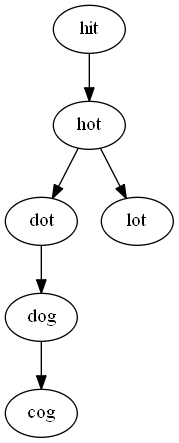

# 127. Word Ladder

- BFS

## tips

- 要看 x 能否只替換一個字母變成 y ， 用枚舉的方法一次替換一個字。

- 在每個 step，把所有的可能性加到 queue 裡面，碰到 endWord 回傳進行了幾輪 bfs。



```cpp
class Solution {
public:
	int ladderLength(string beginWord, string endWord, vector<string>& wordList)
	{

		unordered_set<string> dictionary(wordList.begin(), wordList.end());
        if (!dictionary.count(endWord)) return 0;

		queue<string> words;
		words.push(beginWord);

        // record how many bfs step
		int ans = 0;

        string curr="",temp="";

		while (!words.empty()) {
			int b_size = words.size();
			ans++;
			while(b_size--) {
				curr = words.front(), temp = "";
				words.pop();
                // try to enum all possible replace
				for (int i = 0; i < curr.size(); i++) {
					temp = curr;
					for (int c = 0; c < 26; c++) {
						temp[i] = char('a' + c);
                        // if equal to endWord, return ans
						if (temp == endWord) return ans + 1;
						// if it is in wordList, add to next step bfs
                        if (dictionary.count(temp) ) {
							words.push(temp);
							dictionary.erase(temp);
						}
					}
				}
			}
		}
		return 0;
	}
};
```
